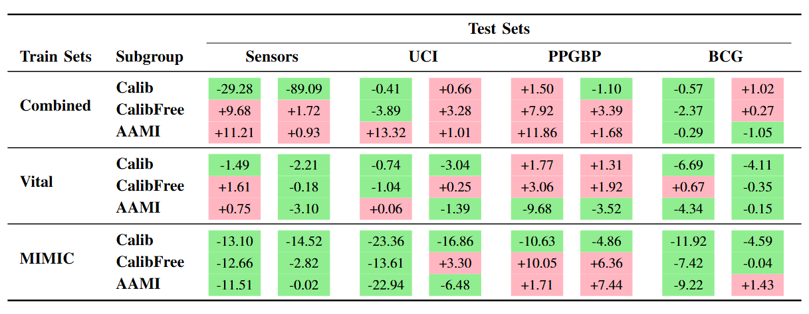

# **Generalizable Deep Learning for Photoplethysmography-Based Blood Pressure Estimation – A Benchmarking Study**

This is the official code repository for the paper 
**["Generalizable Deep Learning for Photoplethysmography-Based Blood Pressure Estimation – A Benchmarking Study"](https://iopscience.iop.org/article/10.1088/3049-477X/ae01a8)** 
by **Mohammad Moulaeifard, Peter Charlton, and Nils Strodthoff**.

---

## **📌 Overview**
This repository contains scripts for training and evaluating AI models on **PulseDB subsets**, while analyzing their generalization to both **PulseDB and external datasets**. The key objectives of this project include:

1. **Preprocessing and converting PulseDB datasets** into machine-readable formats.
2. **OOD (Out-of-Distribution) generalization analysis** by comparing model performance on **in-distribution (ID) vs. OOD datasets**.
3. **Statistical similarity measurement** between PulseDB subsets and external datasets.
4. **Weight-based domain adaptation techniques** to improve model robustness.

---

## **🛠 Step-by-Step Procedure**

### **1. Preprocessing the PulseDB Dataset**
This project utilizes the **PulseDB dataset** (Wang et al., 2023) for **training and ID/OOD evaluations**. We define different subsets based on the data source (**Vital, MIMIC, or Combined**) with different training scenarios such as **Calib, CalibFree, and AAMI-based subsets**.

📌 **To generate the dataset**, follow the instructions in the **PulseDB_Preprocessing** section of this repository:  
🔗 [PulseDB Preprocessing](https://github.com/AI4HealthUOL/ppg-ood-generalization/tree/main/PulseDB_preprocessing)

---

### **2. Preprocessing the External (BP-Benchmarking) Dataset**
This project also utilizes the **External dataset** (González et al., 2023) for **OOD evaluation**. To evaluate the generalization performance of AI models beyond PulseDB, we utilize an external dataset that provides an independent benchmark for non-invasive blood pressure estimation. This dataset allows us to test model robustness in Out-of-Distribution (OOD) scenarios and assess the impact of dataset shifts.

📌 **To prepare the dataset for testing**, follow the instructions in the **External_dataset_Preprocessing** section of this repository:  
🔗 [External Dataset Preprocessing](https://github.com/AI4HealthUOL/ppg-ood-generalization/tree/main/External_dataset_preprocessing)

---
 Summary of the datasets utilized in this study: Two subsets PulseDB (Wang et al. 2023) for training and four external datasets (González et al., 2023) for OOD evaluation.
 

---

### **3. Training Models with PulseDB Subsets**
Once preprocessing is complete, you can train different models using various **PulseDB datasets**., leveraging different training scenarios to optimize model performance. These scenarios include variations in calibration strategies and dataset splits to assess their impact on both in-distribution (ID) and out-of-distribution (OOD) generalization. 

📌 **Follow the instructions in the Processing section of the repository:**  
🔗 [Training Models](https://github.com/AI4HealthUOL/ppg-ood-generalization/tree/main/Processing)

---

### **4. Applying Weights in Training for Domain Adaptation**
To analyze the effect of **using weights in the training procedure**, compute the **weights for each training set**, adjusting them based on dataset similarities and distributional shifts to improve model robustness and adaptation across different domains.

📌 **Use the code and instructions provided in the weighting section:**  
🔗 [Weighting Code](https://github.com/AI4HealthUOL/ppg-ood-generalization/tree/main/Processing/required_codes_files/weighting_codes)

---
Difference in MAE (weighted - unweighted) for ID and OOD generalization on all categories
of PulsedDB dataset using XRes Net1d101 (SBP / DBP). Positive values (red) indicate a degradation
(increase in MAE), while negative values (green) indicate an improvement (decrease in MAE). The mean
improvement through importance weighting across all scenarios is given by 0.43 mmHg for SBP and
0.31 mmHg for DBP.
 
%
---

---
 Difference in MAE (Weighted - unweighted) for OOD generalization on external datasets
(SBP / DBP). Positive values (red) indicate a degradation (increase in MAE), while negative values (green)
indicate an improvement (decrease in MAE). The mean improvement through importance weighting across
all scenarios is given by 3.39 mmHg for SBP and 3.43 mmHg for DBP
 
%
---

---
📖 Citation
Please consider citing our paper:

<pre>
@article{moulaeifard2025generalizable,
  title={Generalizable deep learning for photoplethysmography-based blood pressure estimation--a benchmarking study},
  author={Moulaeifard, Mohammad and Charlton, Peter H and Strodthoff, Nils},
  journal={Machine Learning: Health},
  year={2025}
}
</pre>

---

---
## **📚 References**
📌 **PulseDB Dataset**  
Wang W, Mohseni P, Kilgore KL, Najafizadeh L. PulseDB: A large, cleaned dataset based on MIMIC-III and VitalDB for benchmarking cuff-less blood pressure estimation methods. *Frontiers in Digital Health*. 2023 Feb 8;4:1090854.  

📌 **BP Benchmarking Dataset**  
González S, Hsieh WT, Chen TP. A benchmark for machine-learning based non-invasive blood pressure estimation using photoplethysmogram. *Scientific Data*. 2023 Mar 21;10(1):149.

